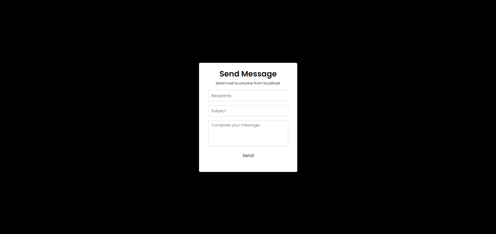

# Localhost Mail Sender

This project is a simple PHP-based web application that allows users to send emails directly from their local development environment.

## Features

- **Send Emails Locally:** Users can send emails from their localhost environment, making it convenient for testing email functionality during web development.
- **User-Friendly Interface:** The application features a user-friendly interface where users can easily enter the recipient's email address, subject, and message content.
- **Real-Time Feedback:** Users receive real-time feedback on the success or failure of email sending operations.
- **Customizable Styling:** Custom CSS styling allows for easy customization of the appearance of the email composition form.

## Usage

1. Clone or download the repository to your local machine.
2. Ensure that PHP is installed on your local development environment.
3. Open the `index.php` file in a web browser to access the Localhost Mail Sender interface.
4. Enter the recipient's email address, subject, and message content in the provided form fields.
5. Click the "Send" button to send the email. You will receive feedback on the success or failure of the operation.

## Contributing

Contributions to the Localhost Mail Sender project are welcome! If you have any feature requests, bug reports, or suggestions for improvements, please feel free to open an issue or submit a pull request on GitHub.

## License

This project is licensed under the MIT License. See the [LICENSE](LICENSE) file for details.
